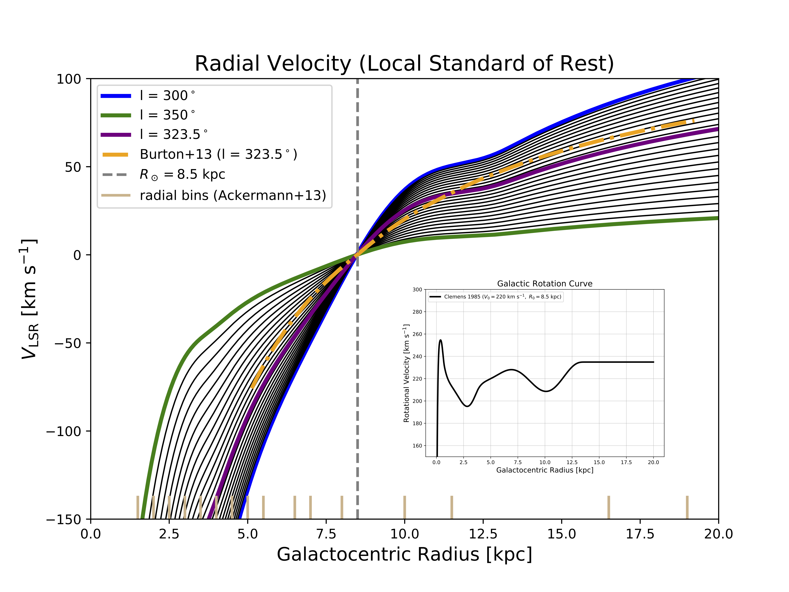

# Analysis Outline <br />
The diffuse gamma-ray emission in the Galaxy arises primarily from the interaction of high-energy cosmic rays (CR) with the interstellar gas and radiation fields.
Of particular interest here is the gas-related emission, which is due to CR protons interacting with the protons
of the gas to generate pions, which then quickly decay to gamma-ray photons. The gas is made up primarily of atomic hydrogen (HI), molecular hydrogen (H2), 
and the so-called dark gas. The method developed here pertains to H2 in particular, however, it can be easily generalized to any of the gas components.

H2 is a symmetric molecule and therefore does not emit at a characterstic wavelength. Instead, the distribution of H2 in the Galaxy 
is typically infered from other tracers, and in particular CO. The most abundant isotopologue of CO is CO12 (here I am using a simple shorthand for simplicity), 
and thus it is used as the primary tracer. However, there are also other rarer isotopologues, including CO13 and CO18.   

In regions of high gas density, CO12 may underestimate the colume density, due to the gas being optically thick. In these regions CO13 and CO18 are better tracers
since they are more rare and thus optically thin. 

The goal of the method contained outlined in this repository is to construct a spatial template for the excess gamma-ray emission that may result from the 
underpredicted CO12 in regions of high density. 

## Getting the MOPRA Data <br />
Our analysis is based on the Mopra survey of CO12, CO13, and CO18, available [here](https://dataverse.harvard.edu/dataset.xhtml?persistentId=doi:10.7910/DVN/LH3BDN). 
The observations cover Galacic longitudes and latitudes of (degrees) 300 < l < 350 and |b|<0.5, respectively. The data is only available in 1x1 deg fields. 
<br />


## Converting the Mopra Data to Column Densities in GalactoCentric Radii <br />

  - The brightness temperature of the gas is stored in a data cube, with dimensions of longitude, latitude, and gas velocity. The first step to process the
  data is to run **plot_rotation.py**, which calls **gas_strucutre_module.py**. 
  
 - The plot_rotation code defines the function the describes the radial velocity of the
  gas relative to the local standard of rest, which dependends on Galactic longitude and Galactocentric radius. 
  This is defined in terms of the Galactic rotational velocity curve from Clemons 1985, which is the GALPROP standard. 
  
  - The radial velocity is used to place the gas at Galactocentric radii, and we define 17 radial bins. 
  
  - The corresponding plot is shown below:
  
  
  
  
  - The execuatable (with the specified seed 432020) is:  <br />
  ```
  cosima -s 432020 GRB170817A.source | tee terminal_output_cosima.txt
  ```
  Note: the part "| tee terminal_output_cosima.txt" just saves the terminal output to a text file for future reference. And the 
  specification of a seed allows different users to directly compare results. Analysis runs with the same seed should generate identical
  output (is there any statistical variation expected here??).
  
  - The main terminal output from the end of the run is below: <br />
